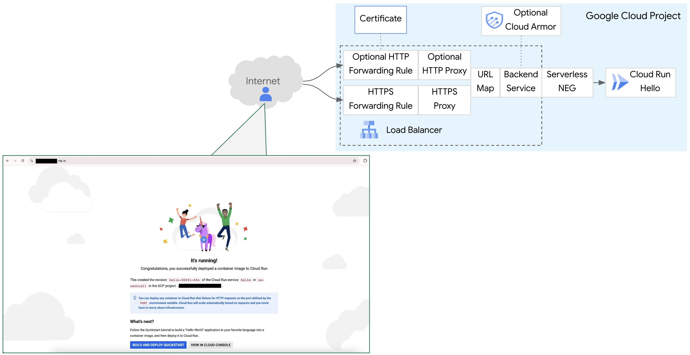

# Global Application Load Balancer with nip.io Validated TLS Cert and Example Backend Application



## Notes
* The intent of this repo is to create a fixed environment for learning, demonstration, and proofs of concept (PoCs), **not production**.
* The script sets the Google Cloud org policy constraints/iam.allowedPolicyMemberDomains to allow all at the project level, so the script may fail in highly regulated environments.
* The actions taken by deploying this repo will add cost. To minimize costs, instructions are provided for how to teardown the demo environment. For more on cost, please refer to Google Cloud public pricing pages for components such as Cloud Run, Global Application Load Balancers, Reserved Public IP Addresses, Data Transfer, and Certificate Manager. 
* Serverless NEG does not as April 2025 support health checks, so no health check in the script. See Serverless network endpoint groups overview > [Limitations with backend services](https://cloud.google.com/load-balancing/docs/negs/serverless-neg-concepts#backend-service-limitations).

## Setup instructions

For visual guidance how to clone the repo, see this X-minute video: [How to Create an Global Application Load Balancer with Cloud Run Backend](https://www.youtube.com/watch?v=JRiStVpTH1w)

1. Clone the this repo

```sh
git clone https://github.com/kurtradecki/gcp-galb-cert-demo.git
```

2. Ensure you have an active GCP account selected in the Cloud shell

```sh
gcloud auth login
gcloud auth application-default login
```

## Deploy the script

To deploy the script, follow this process:
1. Create a project in GCP, if not already created. Reference if needed [Creating and managing projects](https://cloud.google.com/resource-manager/docs/creating-managing-projects)
2. Rename example.tfvars to terraform.tfvars
3. In terraform.tfvars, add the values for variables that need values (see the file for which). All other values can stay the same unless customization required. Reference if needed for how to find project ID, see [Find the project name, number, and ID](https://cloud.google.com/resource-manager/docs/creating-managing-projects#identifying_projects)
4. At the command prompt where you'll run the script, in the Terraform directory, run:

```sh 
terraform init
terraform plan
terraform apply -auto-approve
```

4. Wait a few minutes for the script to complete. You'll see a message similar to "Apply complete!" and then move to the next section.

## Test reaching the application

In the GCP Console, access the created load balancer. There you'll find the IP address for HTTP access (if the optional HTTP forwarding rule was deployed), http://<ip-address>. Click the link to the cert in the load balancer where you'll find the URL for HTTPS access in the form of https://#.#.#.#.nip.io

Note that it may take 2-3 minutes for the HTTP access to the Cloud Run backend to become operational. 

It could take an hour or more for the cert to go active for HTTPS access. For more information on timing and the overall setup, see [Validated TLS Cert Made Simpler: Testing Google Cloud External Load Balancers Without Owning a Domain](https://medium.com/google-cloud/validated-tls-cert-made-simpler-testing-google-cloud-external-load-balancers-without-owning-a-d5a972bac3b2).

## Conclusion & Cleanup

Congratulations! You've successfully deployed the script.

To delete the created infrastructure, run the following command:

```sh
terraform destroy -auto-approve
```

Wait a few minutes for the components created by the Terraform script to be removed. You'll see a message similar to "Destroy complete!" 
